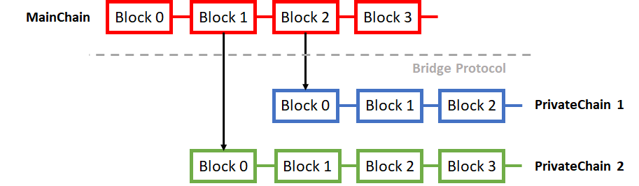
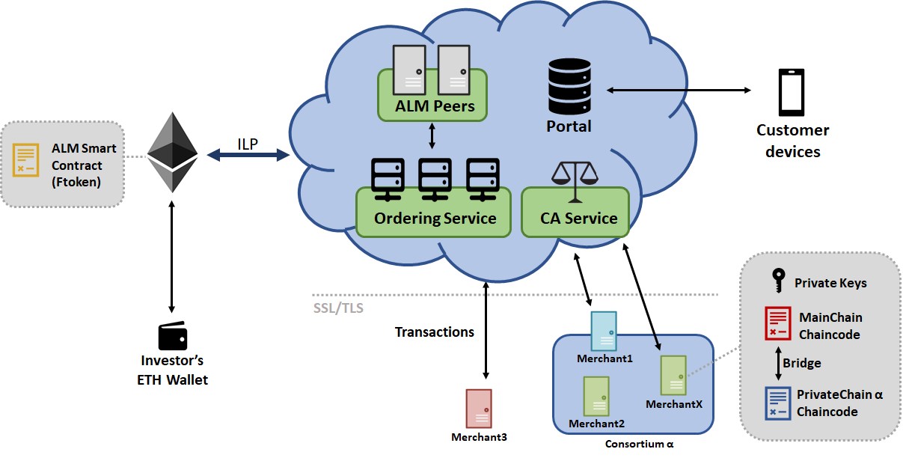
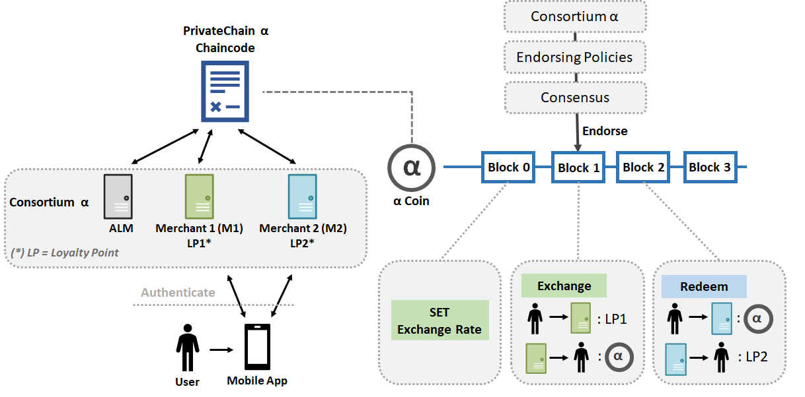
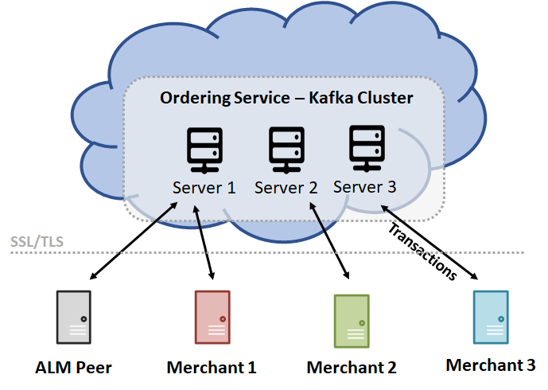
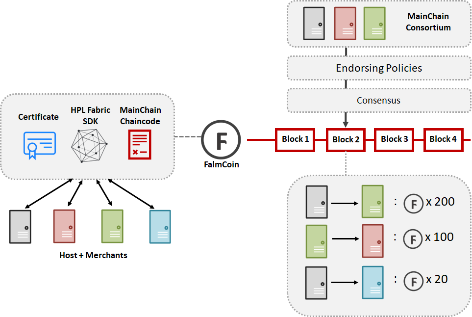
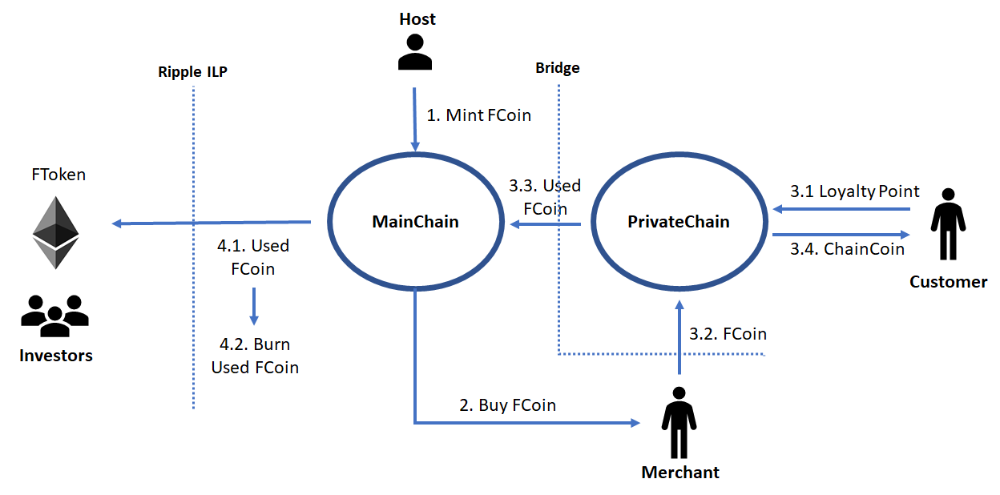

NOTE: THIS DOCUMENT IS COMPOSED FROM OUR WIKI PAGES. THE PURPOSE IS TO PRESENT ALM ARCHITECTURE IN ONE PLACE FOR FURTHER DISSCUSION. IT IS NOT A FULL WHITE-PAPER (YET).

Table of contents

1. [Introduction](#introduction)
1. [High level architecture](#high-level-architecture)
1. [PrivateChain](#privatechain)
1. [MainChain](#mainchain)
1. [Bridge Protocol](#bridge-protocol)
1. [Token economy](#token-economy)

# Introduction
## Loyalty Management ##

["*The economic benefits of high customer loyalty are considerable and, in many industries, explain the differences in profitability among competitors.*"](https://hbr.org/1993/03/loyalty-based-management)

**Customer loyalty** is the [likelihood](http://www.businessdictionary.com/definition/customer-loyalty.html) of previous customers to continue to buy from an organization (a **merchant**). Realizing the importance of improving customer loyalty, organizations often employ **loyalty programs** which define every privilege and offer that a merchant gives customers to gain customers’ satisfaction and encourage them to buy from that merchant repeatedly.

However, loyalty programs are not always successful. A program can fail due to: percentages/prizes are not attractive enough, customers must wait too long to receive prizes, high implement cost, etc. The result is not increasing customer loyalty or worse, loss of customers. 

As business grows, different loyalty program models were born. Nowadays, we often see either:

- **Stand Alone Loyalty**: This is the classic loyalty model, the merchant will create a number of campaigns, accumulative points and ranking for their users. Loyal customers of the merchant will have more advantages such as discounts on purchases, coupon gifts, etc. This classic Loyalty model is quite costly, requires a lot of marketing and has risks such as: customers are not excited because a few points are not enough for prizes, or the prizes are not good enough. Moreover, individual loyalty does not maximize customer loyalty.

- **Group Point**: Group Point is a new step in loyalty when applying in a group of merchants. Merchants in the group use a common **Loyalty Point** system and allow customers to accumulate points upon their transactions with those merchants. A customer then can use these points in any loyalty program from merchants in the group. In Japan, [T-Point](http://tsite.jp/) is a typical example of group point with over 2000 merchants across numerous domains (restaurants, aviation ...)

While Group Point has its clear advantages over the classic one, there are certain areas where a Group Point solution can be improved.

- Merchants do not join the loyalty group when they see their competitors in it.
- Merchant who already has their own loyalty program does not want to spend more money (operating, marketing, persuading users) to switch to the loyalty program of the group.
- Some group points serve only one kind of business such as hotels, tourism, restaurants... which is not attractive enough.
- Redemption between groups is very slow, requires more intermediary review.
- Risks of fraud and information leaks: The group point system is dependent on the admin of the group and there is no consensus mechanism from the Merchant.

## ALM ##

To tackle those challenging areas, we introduce **Akaminds Loyalty Management System (ALM)**, a platform for **directly exchanging loyalty points** among different merchants/organizations. 

- To merchants that already have their own **loyalty management system (LMS)**,  ALM acts as a transparent, decentralized middle ground allows customers from one merchant to exchange or redeem loyalty points from anothers'.

- ALM  also provides a built-in simple loyalty management mechanism for other merchants without existing LMS to participate in the loyalty exchange group.

## Advantages ##

ALM is a **consortium blockchain system**. Such architecture offers a number of advantages over a traditional centralized, cloud-base system.

1. ALM now provides **multiple transparent, immutable “ledgers”** that record loyalty exchange transactions among enterprises.

2. ALM blockchain system allows **complex business models** that requires **strong consistency, high security and data transparency**.

3. ALM **decentralized** nature eliminates system single point of failure, both in term of service availability as well as security compromising.

4. ALM is a **privacy-preserving** system, meaning that customer and enterprise private data does not leak to other parties without authorization.

And many other benefits.

# High level architecture

## Actors ##
ALM system supports 4 main types of actors.

1.	**Host**: The ALM team will provide infrastructure and manpower to build and deploy the platform. We call this party the host. The host provides several, but not limited to, components as: Endorsers, Certificate Authority Services, Message Ordering Services, generic and customized smart contracts (chaincode).
Throughout the project, we sometimes refer alm.vn as the host.

2.	**Merchant**: Organizations that want to participate in the system to exchange loyalty points.
Our scenario currently targets the one that already has a loyalty management system (LMS). However, it should be possible to allow the one without a LMS to join the system in the future. We can offer our own version of a simple LMS based on smart contract.

3.	**Customer**: Customers of merchants that have loyalty points. There are 2 ways for a customer to interact with ALM. 
    - Merchant’s application provides interface to let customer query the blockchain. 
    - Host provides applications (web/mobile) for customers to directly view (with permission from the corresponding merchant) his loyalty point from any merchant in the system.

4.	**Investor**: People who invest into the system in the form of purchasing our crypto-currency token. Different with merchants, investors do not use tokens for loyalty management but to invest and trade to gain benefit. 

Detail interactions among those actors are depicted on our [token economy](pages/Economy) page

## High level Blockchain design ##

At a high level, ALM is a hybrid, permissioned, multi-chain solution. We depict a sample setup as follows.

There is **one Public MainChain** that functions as a normal Public Blockchain. Mainchain is the core of ALM, it links every transactions from every parts of the system together to forge an immutable ledgers. 

There are **multiple PrivateChains** that serve as private channels for different loyalty management *consortiums*. Here, we interpret a consortium as a group of Merchants who agreed to exchange loyalty points together.

We introduce a **Privacy-Preserving Bridge Protocol** to link all PrivateChains to MainChain. The intuition is that, while private transactions details are distributed securely over PrivateChain channels, the Bridge Protocol abstracts those details and create cryptographic verifiable proofs on both chains to ensure system transparency and security.

ALM blockchain is based on [Hyperledger Fabric](https://www.hyperledger.org/projects/fabric).

##  Eco system ##

We now show a rich picture briefly describing components of the ALM eco system.

- The host is depicted as a cloud center that provides backbone Hyperledger services
    - Ordering Service: Instead of traditional P2P communcation like Bitcoin or Ethereum, Hyperledger Fabric offers a *centralized* ordering communication. All peers/clients sends messages to the ordering service and 
    - CA Service: all Merchant peers are required to obtain valid certificates from ALM Certificate Authority service in order to participate in the system. This requirement, however, does not apply for investor on MainChain.    
    - ALM Peers: As a part of the blockchain eco system itself, ALM Peers participate in both MainChain and PrivateChain. ALM peers take part in the consensus and policy enforcement of the chains.
    - Portal: The host provides a web portal allowing customers connect via their desktops/mobile devices.

- Inverstors participate in the system using their ***ETH wallets***. During [ICO](ICO), the host creates a Smart Contract that issues an **ERC20 compatible FToken** on **Ethereum Mainnet**. FToken is a full fledged crypto-currency. Thus, it is able for investors to buy and sell FToken directly on exchange network (e.g. Kyber). Other than that, FToken brings extra benefit to holder as described on ALM [economic model](economy).

- Merchants participate in MainChain via Hyperledger SDK and ALM Chaincodes.

## Why not Bitcoin or Ethereum ?
We design ALM mainly based on a hybrid model. We are not currently considering building the system on an existing public blockchain like Bitcoin. There are several reasons:

- Public blockchain is expensive: Bitcoin and Ethereum transaction cost is extremely high, even with the promise of “lightning network” that is still on paper.
- Public blockchain is slow: The cryptokitties event shows that Ethereum is not ready for high amount of transactions. ALM must be able to handle thousands transactions per day.
- Public blockchain means the system depends on public community. We must at least be able to control the system with regards to security, software update or network data flow.
- Privacy: Putting something on public blockchain means it is replicated across all clients. While there are ways to abstract away the detail via encryption/hashes, it is not straightforward and may put customer/merchants at risk of leaking private data.
- Legal: Cryptocurrency is rumored to be considered illegal in Vietnam. I’m not sure how DApp on public blockchain will be treated.

While a private blockchain solves all those issues, a private chain cannot be used as a public crypto currency - a vision that ALM wants to pursue.

For those reasons, we propose to use a hybrid architecture of [**partially decentralized consortium blockchain**](https://blog.ethereum.org/2015/08/07/on-public-and-private-blockchains/). An excellent reading of this matter can be founded [here](https://blog.ethereum.org/2015/08/07/on-public-and-private-blockchains/)

## Why Hyperledger ?
There are several popular consortium blockchain platforms such as Corda, Hyperledger, BigchainDB, etc. However, many popular one that we can find on the internet is quite immature and definitely not ready for production.

Hyperledger is definitely the most active blockchain for business platform. It is heavily backed by numerous top enterprises such as IBM, Microsoft. Whether Hyperledger is ready for production or not is still a question since we have not seen any successful use-case with the technology. Yet, it is our current safest choice for the job.
# PrivateChain

Based on Hyperledger Fabric, **PrivateChain** refers to ALM private blockchain that allows merchants exchange their loyalty points. We depict the high level architecture of a typical PrivateChain as follows.

## Scenarios
To start with, let us consider a generic loyalty exchange scenario.

- Given a consortium **α** having 2 merchants **M1**, **M2** and the host **ALM**
- Each merchant has his own loyalty point system. We denote this as **LP1** and **LP2** respectively.
- A customer **Alice** has **X** amount of LP1
- Alice wants to use ALM mobile application to exchange LP1 to a certain number **Y** of LP2.

## Blockchain design
Here, we describe our blockchain design for PrivateChain by abstracting away Hyperledger Fabric platform detail. ***Please note that this is a very high level design***, the real implementation will have to adapt to Hyperledger Fabric API.

We first define **ChainCoin**, an intermediate currency. Each merchant will have an **infinitve** amount of ChainCoin. As each PrivateChain has different member composition, we allow each PrivateChain has its own ChainCoin. For example in the figure, consortium α has **α Coin**.

We introduce a **Chaincode** (or a **Smart Contract** ) that defines the format of each transaction in the PrivateChain. There are 3 main transactions as follows.

1. **SetExchangeRate**: Each merchant must set the rate on which his LP can be exchange to ChainCoin. For example:
    - 1 αCoin = n LP1
    - 1 αCoin = m LP2
    This, however, is the most basic way of setting exchange rate. There would be situation where a merchant has different exchange rate for different types of customers. As the scenario change, the Host will have to tailor the ChainCode to reflect the need of each merchant. However, a rule of thumb is that any transaction in chain must be acknowledged by **endorsing peers** depending on the **Policy** when the chain is created. Thus, if a merchant partner does not agree with a specific exchange rate, the transaction is also invalid.
2. **Exchange**: A merchant create a transaction to *exchange* Alice's LP1 to αCoin. The transaction has 2 parts:
    - Alice -> M1: X LP1
    - M1 -> Alice: X/n αCoin
    The transaction must be atomic. The first part is to inform M1 LMS to subtract X LP1 from Alice balance while the second part is to put X/n αCoin into Alice account in the state database of the blockchain.
3. **Redeem**: The reverse process of Exchange.
    - Alice -> M2: X/n αCoin
    - M2 -> Alice: m*X/n LP2

## Customer workflow
TBD:
Need input from offshore team

## Transaction flow
TBD:
Simplify the transaction flow described [here](http://hyperledger-fabric.readthedocs.io/en/latest/txflow.html)

# MainChain

## Peers

As a HPL blockchain, MainChain consists of ***Peers***. Unlike BitCoin or Ethereum, HPL peers connect to a **centralized Ordering Service** to exchange messages/transactions. In particular, our ordering service uses [Apache Kafka](https://kafka.apache.org/) to enable seamless, high throughput, real-time data exchange among peers. Kafka has bult-in **crash fault-tolerant** achieved by internal Raft consensus, **extremely fast** and **horizontally scalable**. Thus, the architect scales well to millions transaction exchange asynchronously. 

MainChain peer composition includes the **host peer** and **all merchants**. Blockchain data is then replicated over those peers via the ordering service.

## FCoin

We introduce ***FCoin***, an internal crypto-currency to use inside MainChain. FCoin is used by merchants to pay "transaction fee" in their corresponding PrivateChain. Obviously, a traditional method is to charge merchants to pay-per-transaction or apply subscription model, similar to paying for computing power on cloud service provider. 

However, as a blockchain system, ALM allows merchants not only to *use* the system, but also *contribute* back to the system by *validate* and *endorse* other merchants' transactions. Such unique property incentivizes merchant to participate into ALM system, at the same time, increase security and trust among merchants as a transaction can be validate/endorsed by different parties. In that direction, we propose 2 ways of using FCoin.

1. When a merchant creates a transaction to exchange/redeem their loyalty point to another merchant's point, he must pay a pre-defined amount of FCoin. This is also called ***Transaction Fee***. This mandatory fee is what makes FCoin has real value to the system. It also prevents merchants to flood the network with unlimited micro transactions.

2. When a merchant participates in the consensus/endorsing process of a PrivateChain or MainChain, he should be rewarded with a certain ammount of FCoin. This is also called ***Endorsing Reward***. The rate of consensus reward should depends on how much effort the participant spends in the process. 

## Consensus
Before going into detail, an excellent reading on consensus on Hyperledger 1.0 is available [here](https://www.hyperledger.org/wp-content/uploads/2017/08/Hyperledger_Arch_WG_Paper_1_Consensus.pdf). We now briefly describe how our system perform consensus.

First, as we currently use Hyperledger Fabric, there are 3 phases: Endorsement, Ordering and Validation.

1. **Endorsement** is driven by policy (eg m out of n signatures) upon which participants (host and merchants) endorse a transaction.
2. **Ordering** phase accepts the endorsed transactions and agrees to the order to be committed to the ledger.
3. **Validation** takes a block of ordered transactions and validates the correctness of the results, including checking endorsement policy and double-spending. 

Currently, as an out-of-the-box solution from Fabric, MainChain uses [Raft](https://www.usenix.org/system/files/conference/atc14/atc14-paper-ongaro.pdf) as the underlying consensus algorithm. The Hyperledger Architecture paper referenced above provides excellent insight on advantages and disadvantages of different consensus algorithm. In this case, Raft is extemely fast and crash-fault tolerance whilst not be able to tolerant Byzantine behavior. In the future, further improvement towards Byzantine tolerant can be implemented. For example, [BFT-SMART](https://arxiv.org/pdf/1709.06921.pdf) is a great reference that we want to follow in the future.

## Transactions
TBD: Model a sample transaction.

## Chaincode
TBD: Design a sample interface for a ChainCode that satisfies the requirements.
# Bridge Protocol

We require a merchant to pay a small amount of FCoin in order to publish a transaction in a private chain. This fee is fixed (exact numbers are TBD) and the same for all transactions. Since FCoin only circulates in the MainChain, the merchant needs to pay the fee in the main chain first. Once it has been done, the merchant can publish the transaction in the private chain. 

Suppose that merchant **A** wants to publish transactions in private chain **C** that it has access to. Suppose that the transaction fee is **F**. If the merchant's desire is to publish **X** transactions in the private chain **C**, it needs to do the following steps.

1. It makes a transaction in the main chain, which states that it sends **F** * **X** FCoin to a predefined special address (e.g. 0x00..00). This is equal to burning the coins. The transaction also contains the following information: 
  * the private chain ID **C**, 
  * the public key of the merchant in the private chain, which will be used to make transactions. 
We refer to this transaction as the _commitment transaction_.
2.  After the transaction has been accepted to the main chain, the merchant can publish at most **X** transactions in private chain **C**. Each of these transactions need to include the ID of the commitment transaction.

To verify that a merchant has paid for a transaction, a peer needs to do the following  checks: 

1. There exists a commitment transaction in the main chain with the ID included in the transaction. 

2. The commitment transaction must contains exactly the public key of the merchant and the ID of the private chain.

3. Assuming that the commitment transaction contains enough fee to pay for **X** transactions, there are less than **X** transactions with the same commitment ID in the private chain. 

# Token economy

As we defien earlier this whitepaper, we have two kind of cryptographic token, FCoin and FToken. FCoin is used to pay for every transaction happening in the private chain. FToken is used for ICO sale. The person who is the holder of FToken has a chance of getting FToken reward.

Every year, the system extracts an amount of the total of FCoin transaction fee which it has been received to reward FToken holder.

We define:

**T**: the total of FCoin transaction fee

**R**: the amount of FCoin would be rewarded

**p**: the rate of reward, **0** < **p** < **1**

We have:

**R** **=** **p** ***** **T**

For the FToken holders, the FCoin reward they would recevie based on how many FToken they hold.

We define:
**f**: the amount of FToken which the holder keeps in her wallet

**F**: the total of FToken issued in ICO

**rand**: a randomness number, **0** **<** **rand** **<** **0**  

**h**: The FCoin reward the holder would receive

We have:

**h** **=** **(** **f** **/** **F**) ** * ** **rand** ** * ** **R**
